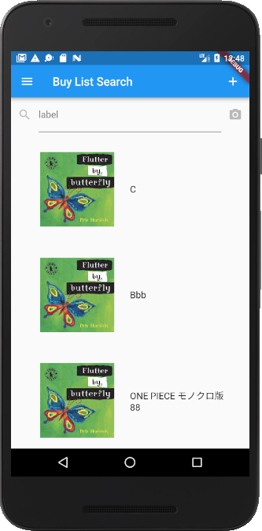
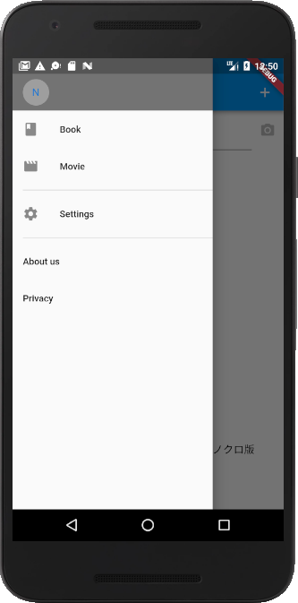
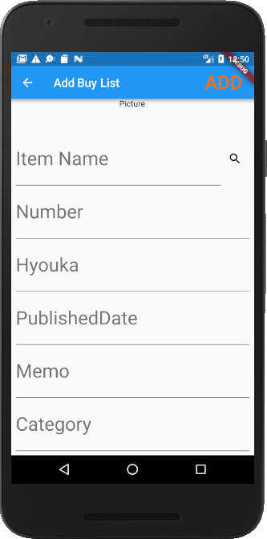

# 書籍管理アプリ
未読・既読書籍を管理するアプリ  
登録した書籍の新刊通知を行う。  
書籍の登録はネット検索だけでなく、バーコードからも行える。  
評価を入れることにより、他人へお勧めすることが可能。  
他者の評価を参考にすることができる。  

## フレームワーク・ライブラリ
Flutter  
Dart  
AmazonAPI  
Firebase database  

## 作成画面
メイン画面  

アイテム追加画面  

アイテム画像検索画面  

アイテム詳細画面  

## 作成予定機能
### 全体
- 登録した書籍の新刊通知

### メイン画面
- アイテム詳細画面への遷移
- UI調整
- アイテムのソート・フィルター
- SNSへの投稿
- 他者の評価参照
- 書籍以外（映画等）にも対応

### アイテム追加画面
- バーコードからアイテム追加

### アイテム画像検索画面
- アイテム追加時にネットから書籍情報を取得し、選択した書籍情報をアイテム追加画面へ反映させる

### アイテム詳細画面
- 書籍の詳細情報を表示
- 書籍の登録情報を変更

